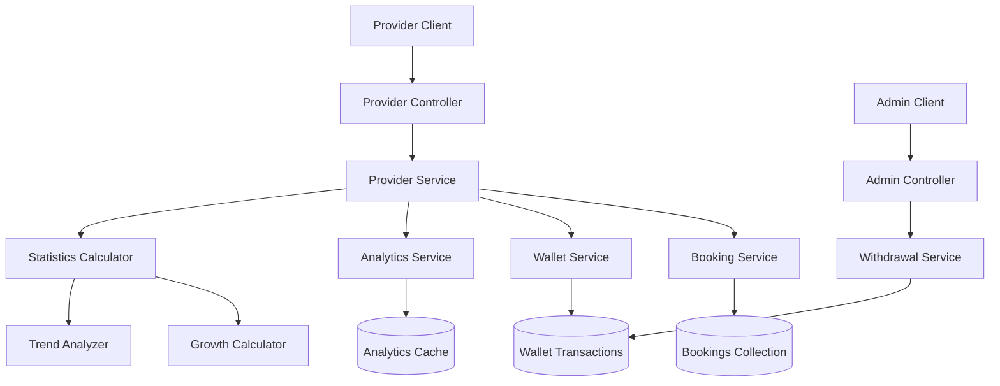

# Provider Dashboard Endpoints Design

## Overview

The Provider Dashboard Endpoints system provides comprehensive analytics, financial management, and operational insights for service providers. It integrates with existing booking, wallet, and user systems to deliver real-time dashboard data, earnings analytics, withdrawal management, and performance metrics.

## Architecture

### High-Level Architecture



### Data Flow

1. **Dashboard Summary**: Aggregate data from bookings, wallet, and reviews → Calculate statistics → Return formatted response
2. **Earnings Analytics**: Query transactions by period → Calculate growth metrics → Generate breakdown data
3. **Withdrawal Management**: Validate request → Calculate fees → Create withdrawal record → Update wallet balance
4. **Analytics**: Query historical data → Apply time filters → Calculate trends and insights

## Components and Interfaces

### 1. Provider Controller

```typescript
// src/providers/providers.controller.ts
@Controller('providers')
@UseGuards(JwtAuthGuard, RoleGuard)
@Roles(UserRole.PROVIDER)
export class ProvidersController {
  
  @Get('dashboard')
  async getDashboardSummary(@Request() req): Promise<DashboardSummaryDto>;
  
  @Get('earnings')
  async getEarningsSummary(@Query() query: EarningsQueryDto, @Request() req): Promise<EarningsSummaryDto>;
  
  @Get('wallet')
  async getWalletInfo(@Request() req): Promise<WalletInfoDto>;
  
  @Post('withdrawals')
  async requestWithdrawal(@Body() dto: WithdrawalRequestDto, @Request() req): Promise<WithdrawalResponseDto>;
  
  @Get('withdrawals')
  async getWithdrawalHistory(@Query() query: WithdrawalQueryDto, @Request() req): Promise<WithdrawalHistoryDto>;
  
  @Get('analytics')
  async getAnalytics(@Query() query: AnalyticsQueryDto, @Request() req): Promise<AnalyticsDto>;
  
  @Get('bookings/upcoming')
  async getUpcomingBookings(@Query() query: UpcomingBookingsQueryDto, @Request() req): Promise<UpcomingBookingsDto>;
}
```

### 2. Admin Controller for Withdrawal Management

```typescript
// src/admin/admin.controller.ts (extend existing)
@Patch('withdrawals/:id')
@UseGuards(JwtAuthGuard, RoleGuard)
@Roles(UserRole.ADMIN)
async updateWithdrawalStatus(
  @Param('id') id: string,
  @Body() dto: UpdateWithdrawalStatusDto
): Promise<WithdrawalResponseDto>;
```

### 3. DTOs (Data Transfer Objects)

```typescript
// Dashboard DTOs
export class DashboardSummaryDto {
  provider: ProviderSummaryDto;
  statistics: ProviderStatisticsDto;
  nextBooking?: NextBookingDto;
  recentActivities: ActivityDto[];
}

export class ProviderSummaryDto {
  id: string;
  fullName: string;
  totalEarnings: number;
  availableBalance: number;
  pendingBalance: number;
  totalWithdrawn: number;
  averageRating: number;
  totalReviews: number;
  joinedDate: Date;
}

export class ProviderStatisticsDto {
  activeServices: number;
  totalBookings: number;
  thisWeekBookings: number;
  thisMonthBookings: number;
  completedBookings: number;
  cancelledBookings: number;
  pendingBookings: number;
  monthlyEarningsGrowth: number;
  weeklyBookingsGrowth: number;
}

// Earnings DTOs
export class EarningsQueryDto {
  @IsOptional()
  @IsEnum(['week', 'month', 'year', 'all'])
  period?: string = 'month';
  
  @IsOptional()
  @IsDateString()
  startDate?: string;
  
  @IsOptional()
  @IsDateString()
  endDate?: string;
}

export class EarningsSummaryDto {
  summary: EarningsSummary;
  periodEarnings: PeriodEarnings;
  earningsBreakdown: DailyEarnings[];
}

// Withdrawal DTOs
export class WithdrawalRequestDto {
  @IsNumber()
  @Min(5000)
  @Max(500000)
  amount: number;
  
  @IsEnum(['bank_transfer', 'mobile_money', 'paypal'])
  withdrawalMethod: string;
  
  @ValidateIf(o => o.withdrawalMethod === 'bank_transfer')
  @IsObject()
  bankDetails?: BankDetailsDto;
  
  @ValidateIf(o => o.withdrawalMethod === 'mobile_money')
  @IsObject()
  mobileMoneyDetails?: MobileMoneyDetailsDto;
  
  @IsOptional()
  @IsString()
  notes?: string;
}

export class BankDetailsDto {
  @IsString()
  accountName: string;
  
  @IsString()
  accountNumber: string;
  
  @IsString()
  bankName: string;
  
  @IsOptional()
  @IsString()
  swiftCode?: string;
}

// Analytics DTOs
export class AnalyticsQueryDto {
  @IsOptional()
  @IsEnum(['week', 'month', 'quarter', 'year'])
  period?: string = 'month';
}

export class AnalyticsDto {
  period: string;
  bookings: BookingAnalytics;
  earnings: EarningsAnalytics;
  services: ServiceAnalytics;
  ratings: RatingAnalytics;
  peakHours: PeakHourData[];
  weeklyTrend: WeeklyTrendData[];
}
```

### 4. Service Layer Interfaces

```typescript
// src/providers/interfaces/provider-dashboard.interface.ts
export interface IProviderDashboardService {
  getDashboardSummary(providerId: string): Promise<DashboardSummaryDto>;
  getEarningsSummary(providerId: string, query: EarningsQueryDto): Promise<EarningsSummaryDto>;
  getWalletInfo(providerId: string): Promise<WalletInfoDto>;
  getAnalytics(providerId: string, query: AnalyticsQueryDto): Promise<AnalyticsDto>;
  getUpcomingBookings(providerId: string, query: UpcomingBookingsQueryDto): Promise<UpcomingBookingsDto>;
}

export interface IWithdrawalService {
  requestWithdrawal(providerId: string, dto: WithdrawalRequestDto): Promise<WithdrawalResponseDto>;
  getWithdrawalHistory(providerId: string, query: WithdrawalQueryDto): Promise<WithdrawalHistoryDto>;
  updateWithdrawalStatus(withdrawalId: string, dto: UpdateWithdrawalStatusDto): Promise<WithdrawalResponseDto>;
  calculateWithdrawalFee(amount: number, method: string): number;
  validateWithdrawalLimits(providerId: string, amount: number): Promise<boolean>;
}
```

## Data Models

### Enhanced Wallet Transaction Schema

```typescript
// src/wallet/schemas/wallet-transaction.schema.ts (extend existing)
export enum TransactionType {
  EARNING = 'earning',
  WITHDRAWAL = 'withdrawal',
  COMMISSION = 'commission',
  REFUND = 'refund',
  FEE = 'fee'
}

export enum WithdrawalMethod {
  BANK_TRANSFER = 'bank_transfer',
  MOBILE_MONEY = 'mobile_money',
  PAYPAL = 'paypal'
}

export enum WithdrawalStatus {
  PENDING = 'pending',
  PROCESSING = 'processing',
  COMPLETED = 'completed',
  FAILED = 'failed'
}

@Schema({ timestamps: true })
export class WithdrawalRequest {
  @Prop({ type: Types.ObjectId, ref: 'User', required: true })
  providerId: Types.ObjectId;
  
  @Prop({ required: true })
  amount: number;
  
  @Prop({ required: true })
  withdrawalFee: number;
  
  @Prop({ required: true })
  netAmount: number;
  
  @Prop({ type: String, enum: WithdrawalMethod, required: true })
  withdrawalMethod: WithdrawalMethod;
  
  @Prop({ type: String, enum: WithdrawalStatus, default: WithdrawalStatus.PENDING })
  status: WithdrawalStatus;
  
  @Prop({ type: Object })
  paymentDetails: any; // Bank details, mobile money info, etc.
  
  @Prop()
  notes?: string;
  
  @Prop()
  adminNotes?: string;
  
  @Prop()
  transactionReference?: string;
  
  @Prop()
  estimatedProcessingTime?: string;
  
  @Prop()
  processedAt?: Date;
  
  @Prop({ type: Types.ObjectId, ref: 'User' })
  processedBy?: Types.ObjectId;
}
```

### Provider Analytics Cache Schema

```typescript
// src/providers/schemas/provider-analytics.schema.ts
@Schema({ timestamps: true })
export class ProviderAnalytics {
  @Prop({ type: Types.ObjectId, ref: 'User', required: true })
  providerId: Types.ObjectId;
  
  @Prop({ required: true })
  period: string; // 'week', 'month', 'quarter', 'year'
  
  @Prop({ required: true })
  startDate: Date;
  
  @Prop({ required: true })
  endDate: Date;
  
  @Prop({ type: Object })
  bookingStats: {
    total: number;
    completed: number;
    cancelled: number;
    pending: number;
    growth: number;
  };
  
  @Prop({ type: Object })
  earningsStats: {
    total: number;
    average: number;
    growth: number;
  };
  
  @Prop({ type: Object })
  serviceStats: {
    mostBooked: ServiceStat;
    topEarning: ServiceStat;
  };
  
  @Prop({ type: Object })
  ratingStats: {
    average: number;
    totalReviews: number;
    distribution: Record<number, number>;
  };
  
  @Prop({ type: [Object] })
  peakHours: PeakHourData[];
  
  @Prop({ type: [Object] })
  weeklyTrend: WeeklyTrendData[];
  
  @Prop({ default: Date.now })
  calculatedAt: Date;
}
```

## Business Logic Implementation

### 1. Dashboard Summary Calculation

```typescript
// src/providers/services/dashboard.service.ts
async calculateDashboardSummary(providerId: string): Promise<DashboardSummaryDto> {
  const [
    provider,
    walletInfo,
    bookingStats,
    nextBooking,
    recentActivities
  ] = await Promise.all([
    this.getProviderInfo(providerId),
    this.walletService.getBalance(providerId),
    this.calculateBookingStatistics(providerId),
    this.getNextUpcomingBooking(providerId),
    this.getRecentActivities(providerId)
  ]);
  
  return {
    provider: {
      ...provider,
      ...walletInfo
    },
    statistics: bookingStats,
    nextBooking,
    recentActivities
  };
}
```

### 2. Earnings Analytics

```typescript
async calculateEarningsAnalytics(providerId: string, query: EarningsQueryDto): Promise<EarningsSummaryDto> {
  const { startDate, endDate } = this.parsePeriod(query.period, query.startDate, query.endDate);
  
  const [summary, periodEarnings, breakdown] = await Promise.all([
    this.walletService.getEarningsSummary(providerId),
    this.calculatePeriodEarnings(providerId, startDate, endDate),
    this.getDailyEarningsBreakdown(providerId, startDate, endDate)
  ]);
  
  return {
    summary,
    periodEarnings,
    earningsBreakdown: breakdown
  };
}
```

### 3. Withdrawal Processing

```typescript
async processWithdrawalRequest(providerId: string, dto: WithdrawalRequestDto): Promise<WithdrawalResponseDto> {
  // Validate withdrawal limits
  await this.validateWithdrawalLimits(providerId, dto.amount);
  
  // Check available balance
  const balance = await this.walletService.getAvailableBalance(providerId);
  if (balance < dto.amount) {
    throw new BadRequestException('Insufficient balance');
  }
  
  // Calculate fees
  const withdrawalFee = this.calculateWithdrawalFee(dto.amount, dto.withdrawalMethod);
  const netAmount = dto.amount - withdrawalFee;
  
  // Create withdrawal request
  const withdrawal = await this.createWithdrawalRequest({
    ...dto,
    providerId,
    withdrawalFee,
    netAmount,
    estimatedProcessingTime: this.getProcessingTime(dto.withdrawalMethod)
  });
  
  // Update wallet balance (reserve funds)
  await this.walletService.reserveFunds(providerId, dto.amount);
  
  return withdrawal;
}
```

## Error Handling

### Custom Exceptions

```typescript
// src/providers/exceptions/provider.exceptions.ts
export class InsufficientBalanceException extends BadRequestException {
  constructor(available: number, requested: number) {
    super(`Insufficient balance. Available: ${available}, Requested: ${requested}`);
  }
}

export class WithdrawalLimitExceededException extends BadRequestException {
  constructor(limit: number, amount: number) {
    super(`Withdrawal amount ${amount} exceeds limit of ${limit}`);
  }
}

export class InvalidWithdrawalMethodException extends BadRequestException {
  constructor(method: string) {
    super(`Invalid withdrawal method: ${method}`);
  }
}

export class WithdrawalNotFoundException extends NotFoundException {
  constructor(id: string) {
    super(`Withdrawal request with ID ${id} not found`);
  }
}
```

## Security and Validation

### Rate Limiting

```typescript
// Rate limiting configuration
const rateLimits = {
  dashboard: '100 per hour',
  earnings: '50 per hour', 
  analytics: '50 per hour',
  withdrawalRequest: '10 per hour',
  withdrawalHistory: '100 per hour'
};
```

### Input Validation

```typescript
// Withdrawal validation rules
const withdrawalLimits = {
  minimum: 5000, // FCFA
  maximum: 500000, // FCFA per transaction
  dailyLimit: 1000000, // FCFA
  monthlyLimit: 5000000 // FCFA
};

const withdrawalFees = {
  bank_transfer: 500, // Flat fee
  mobile_money: { rate: 0.02, min: 200, max: 1000 }, // 2% with min/max
  paypal: { rate: 0.03, flat: 500 } // 3% + flat fee
};
```

## Performance Optimization

### Caching Strategy

```typescript
// Redis caching for analytics
interface CacheKeys {
  dashboardSummary: `provider:dashboard:${providerId}`;
  earnings: `provider:earnings:${providerId}:${period}`;
  analytics: `provider:analytics:${providerId}:${period}`;
  upcomingBookings: `provider:upcoming:${providerId}`;
}

const cacheTTL = {
  dashboardSummary: 300, // 5 minutes
  earnings: 1800, // 30 minutes
  analytics: 3600, // 1 hour
  upcomingBookings: 600 // 10 minutes
};
```

### Database Optimization

```typescript
// Aggregation pipelines for analytics
const bookingAnalyticsPipeline = [
  { $match: { providerId: ObjectId(providerId), createdAt: { $gte: startDate, $lte: endDate } } },
  { $group: {
    _id: null,
    total: { $sum: 1 },
    completed: { $sum: { $cond: [{ $eq: ['$status', 'completed'] }, 1, 0] } },
    cancelled: { $sum: { $cond: [{ $eq: ['$status', 'cancelled'] }, 1, 0] } },
    totalEarnings: { $sum: '$totalAmount' }
  }}
];
```

## Testing Strategy

### Unit Tests
- Dashboard calculation logic
- Earnings analytics computation
- Withdrawal fee calculations
- Validation rules and limits

### Integration Tests
- End-to-end dashboard data flow
- Withdrawal request processing
- Analytics data aggregation
- Cache invalidation scenarios

### Performance Tests
- Dashboard load times under high concurrency
- Analytics query performance
- Cache hit rates and effectiveness

This design provides a comprehensive, scalable solution for provider dashboard functionality with robust financial management and detailed analytics capabilities.