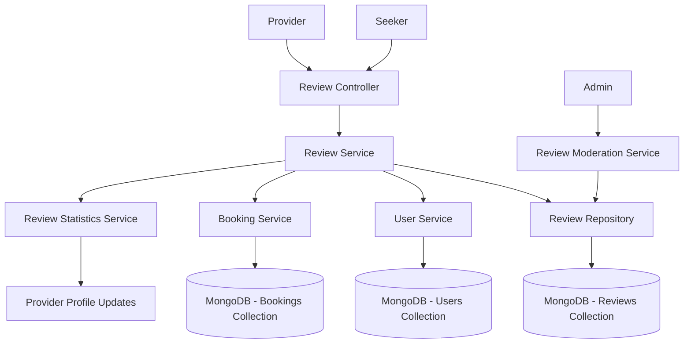

# Provider Review System Design

## Overview

The Provider Review System enables seekers to leave detailed reviews and ratings for service providers, creating a comprehensive feedback mechanism that helps build trust and quality assurance in the marketplace. The system integrates with existing booking workflows and provides rich querying capabilities for both providers and seekers.

## Architecture

### High-Level Architecture



### Data Flow

1. **Review Creation**: Seeker submits review → Validation → Save to database → Update provider statistics
2. **Review Retrieval**: Request → Query with filters/pagination → Return formatted results
3. **Review Moderation**: Admin action → Update review status → Recalculate statistics
4. **Provider Response**: Provider responds → Validation → Save response → Link to original review

## Components and Interfaces

### 1. Review Schema

```typescript
// src/users/schemas/provider-review.schema.ts
export enum ReviewStatus {
  ACTIVE = 'active',
  HIDDEN = 'hidden',
  DELETED = 'deleted',
  PENDING_MODERATION = 'pending_moderation'
}

export class ProviderReview {
  _id: ObjectId;
  providerId: ObjectId; // Reference to User (provider)
  reviewerId: ObjectId; // Reference to User (seeker)
  rating: number; // 1-5 stars
  comment?: string; // Optional text review
  serviceCategory?: ServiceCategory; // Which service category
  relatedBookingId?: ObjectId; // Optional booking reference
  status: ReviewStatus;
  
  // Provider response
  providerResponse?: {
    text: string;
    respondedAt: Date;
    editedAt?: Date;
  };
  
  // Moderation
  moderationInfo?: {
    moderatedBy: ObjectId;
    moderatedAt: Date;
    reason: string;
    originalStatus: ReviewStatus;
  };
  
  // Audit trail
  editHistory?: Array<{
    editedAt: Date;
    previousRating?: number;
    previousComment?: string;
  }>;
  
  createdAt: Date;
  updatedAt: Date;
}
```

### 2. Review Statistics Schema

```typescript
// src/users/schemas/provider-statistics.schema.ts
export class ProviderStatistics {
  _id: ObjectId;
  providerId: ObjectId;
  
  // Overall statistics
  averageRating: number;
  totalReviews: number;
  
  // Rating distribution
  ratingDistribution: {
    fiveStars: number;
    fourStars: number;
    threeStars: number;
    twoStars: number;
    oneStar: number;
  };
  
  // Category-specific ratings
  categoryRatings: Map<ServiceCategory, {
    averageRating: number;
    totalReviews: number;
  }>;
  
  // Recent activity
  lastReviewDate?: Date;
  recentReviewsCount: number; // Reviews in last 30 days
  
  updatedAt: Date;
}
```

### 3. DTOs (Data Transfer Objects)

```typescript
// src/users/dto/create-provider-review.dto.ts (already exists, enhanced)
export class CreateProviderReviewDto {
  @IsNumber() @Min(1) @Max(5)
  rating: number;
  
  @IsString() @IsOptional() @MaxLength(500)
  comment?: string;
  
  @IsEnum(ServiceCategory) @IsOptional()
  serviceCategory?: ServiceCategory;
  
  @IsMongoId() @IsOptional()
  relatedBookingId?: string;
}

// src/users/dto/update-provider-review.dto.ts
export class UpdateProviderReviewDto {
  @IsNumber() @Min(1) @Max(5) @IsOptional()
  rating?: number;
  
  @IsString() @IsOptional() @MaxLength(500)
  comment?: string;
  
  @IsEnum(ServiceCategory) @IsOptional()
  serviceCategory?: ServiceCategory;
}

// src/users/dto/provider-response.dto.ts
export class ProviderResponseDto {
  @IsString() @MaxLength(300)
  text: string;
}

// src/users/dto/review-query.dto.ts
export class ReviewQueryDto {
  @IsOptional() @IsEnum(ServiceCategory)
  category?: ServiceCategory;
  
  @IsOptional() @IsNumber() @Min(1) @Max(5)
  minRating?: number;
  
  @IsOptional() @IsNumber() @Min(1) @Max(5)
  maxRating?: number;
  
  @IsOptional() @IsNumber() @Min(1)
  page?: number = 1;
  
  @IsOptional() @IsNumber() @Min(1) @Max(50)
  limit?: number = 10;
  
  @IsOptional() @IsEnum(['newest', 'oldest', 'highest_rating', 'lowest_rating'])
  sortBy?: string = 'newest';
}
```

### 4. Service Layer Interfaces

```typescript
// src/users/interfaces/review.interface.ts
export interface IReviewService {
  // Core CRUD operations
  createReview(providerId: string, reviewData: CreateProviderReviewDto, reviewerId: string): Promise<ProviderReview>;
  updateReview(reviewId: string, updateData: UpdateProviderReviewDto, reviewerId: string): Promise<ProviderReview>;
  deleteReview(reviewId: string, reviewerId: string): Promise<void>;
  
  // Query operations
  getProviderReviews(providerId: string, query: ReviewQueryDto): Promise<PaginatedReviews>;
  getReviewById(reviewId: string): Promise<ProviderReview>;
  getReviewerReviews(reviewerId: string, query: ReviewQueryDto): Promise<PaginatedReviews>;
  
  // Provider responses
  addProviderResponse(reviewId: string, response: ProviderResponseDto, providerId: string): Promise<ProviderReview>;
  updateProviderResponse(reviewId: string, response: ProviderResponseDto, providerId: string): Promise<ProviderReview>;
  
  // Statistics
  getProviderStatistics(providerId: string): Promise<ProviderStatistics>;
  updateProviderStatistics(providerId: string): Promise<ProviderStatistics>;
  
  // Moderation
  moderateReview(reviewId: string, action: ModerationAction, moderatorId: string, reason: string): Promise<ProviderReview>;
}

export interface PaginatedReviews {
  reviews: ProviderReview[];
  pagination: {
    total: number;
    page: number;
    limit: number;
    totalPages: number;
  };
  statistics?: {
    averageRating: number;
    totalReviews: number;
    ratingDistribution: Record<number, number>;
  };
}
```

## Data Models

### Database Collections

#### 1. provider_reviews Collection
```javascript
{
  _id: ObjectId,
  providerId: ObjectId, // indexed
  reviewerId: ObjectId, // indexed
  rating: Number, // 1-5
  comment: String, // max 500 chars
  serviceCategory: String, // enum
  relatedBookingId: ObjectId, // optional, indexed
  status: String, // enum: active, hidden, deleted, pending_moderation
  
  providerResponse: {
    text: String, // max 300 chars
    respondedAt: Date,
    editedAt: Date
  },
  
  moderationInfo: {
    moderatedBy: ObjectId,
    moderatedAt: Date,
    reason: String,
    originalStatus: String
  },
  
  editHistory: [{
    editedAt: Date,
    previousRating: Number,
    previousComment: String
  }],
  
  createdAt: Date,
  updatedAt: Date
}
```

#### 2. provider_statistics Collection
```javascript
{
  _id: ObjectId,
  providerId: ObjectId, // unique index
  averageRating: Number,
  totalReviews: Number,
  
  ratingDistribution: {
    fiveStars: Number,
    fourStars: Number,
    threeStars: Number,
    twoStars: Number,
    oneStar: Number
  },
  
  categoryRatings: {
    "cleaning": {
      averageRating: Number,
      totalReviews: Number
    },
    // ... other categories
  },
  
  lastReviewDate: Date,
  recentReviewsCount: Number,
  updatedAt: Date
}
```

### Database Indexes

```javascript
// provider_reviews collection indexes
db.provider_reviews.createIndex({ providerId: 1, createdAt: -1 });
db.provider_reviews.createIndex({ reviewerId: 1, createdAt: -1 });
db.provider_reviews.createIndex({ providerId: 1, serviceCategory: 1 });
db.provider_reviews.createIndex({ providerId: 1, rating: 1 });
db.provider_reviews.createIndex({ relatedBookingId: 1 });
db.provider_reviews.createIndex({ status: 1 });

// Compound index for efficient queries
db.provider_reviews.createIndex({ 
  providerId: 1, 
  status: 1, 
  serviceCategory: 1, 
  createdAt: -1 
});

// provider_statistics collection indexes
db.provider_statistics.createIndex({ providerId: 1 }, { unique: true });
```

## Error Handling

### Custom Exceptions

```typescript
// src/users/exceptions/review.exceptions.ts
export class ReviewNotFoundException extends NotFoundException {
  constructor(reviewId: string) {
    super(`Review with ID ${reviewId} not found`);
  }
}

export class DuplicateReviewException extends ConflictException {
  constructor() {
    super('You have already reviewed this provider');
  }
}

export class ReviewEditTimeExpiredException extends ForbiddenException {
  constructor() {
    super('Review can only be edited within 7 days of creation');
  }
}

export class UnauthorizedReviewActionException extends ForbiddenException {
  constructor(action: string) {
    super(`You are not authorized to ${action} this review`);
  }
}

export class InvalidRatingException extends BadRequestException {
  constructor() {
    super('Rating must be between 1 and 5 stars');
  }
}
```

### Error Response Format

```typescript
// Standard error responses
{
  statusCode: 400 | 401 | 403 | 404 | 409 | 500,
  message: string | string[],
  error: string,
  timestamp: string,
  path: string
}
```

## Testing Strategy

### Unit Tests

1. **Review Service Tests**
   - Test review creation with valid/invalid data
   - Test review updates within/outside time limits
   - Test review deletion and soft deletion
   - Test statistics calculation accuracy
   - Test provider response functionality

2. **Review Repository Tests**
   - Test database queries with various filters
   - Test pagination functionality
   - Test index usage and performance
   - Test data integrity constraints

3. **DTO Validation Tests**
   - Test input validation for all DTOs
   - Test edge cases and boundary conditions
   - Test enum validation
   - Test string length limits

### Integration Tests

1. **API Endpoint Tests**
   - Test complete review workflow
   - Test authentication and authorization
   - Test error handling and status codes
   - Test response format consistency

2. **Database Integration Tests**
   - Test transaction handling
   - Test concurrent review submissions
   - Test statistics update consistency
   - Test cascade operations

### End-to-End Tests

1. **User Journey Tests**
   - Complete booking → review → response workflow
   - Provider statistics update verification
   - Review moderation workflow
   - Multi-user concurrent scenarios

## Performance Considerations

### Caching Strategy

```typescript
// Redis caching for frequently accessed data
interface CacheStrategy {
  // Cache provider statistics for 1 hour
  providerStats: {
    key: `provider:stats:${providerId}`,
    ttl: 3600
  };
  
  // Cache recent reviews for 30 minutes
  recentReviews: {
    key: `provider:reviews:${providerId}:page:${page}`,
    ttl: 1800
  };
  
  // Cache rating distribution for 2 hours
  ratingDistribution: {
    key: `provider:ratings:${providerId}`,
    ttl: 7200
  };
}
```

### Database Optimization

1. **Aggregation Pipelines** for complex statistics queries
2. **Batch Updates** for statistics recalculation
3. **Read Replicas** for review queries
4. **Connection Pooling** for high-concurrency scenarios

### API Rate Limiting

```typescript
// Rate limiting configuration
const rateLimits = {
  createReview: '5 per hour per user',
  updateReview: '10 per hour per user',
  getReviews: '100 per minute per IP',
  providerResponse: '20 per hour per provider'
};
```

## Security Considerations

### Input Validation
- Sanitize all text inputs to prevent XSS
- Validate rating values strictly (1-5)
- Limit comment length to prevent abuse
- Validate MongoDB ObjectIds

### Authorization
- Ensure reviewers can only edit their own reviews
- Ensure providers can only respond to their own reviews
- Implement role-based access for moderation
- Verify booking relationship for review creation

### Data Privacy
- Hide reviewer personal information in public views
- Implement soft deletion for audit trails
- Encrypt sensitive moderation data
- Comply with data retention policies

## Monitoring and Analytics

### Metrics to Track
- Review submission rate
- Average rating trends
- Response time for provider responses
- Moderation queue size
- Review edit/deletion frequency

### Logging Strategy
- Log all review CRUD operations
- Log moderation actions with full context
- Log statistics calculation events
- Log performance metrics for queries

This design provides a comprehensive, scalable, and maintainable review system that integrates seamlessly with the existing HAS platform architecture.